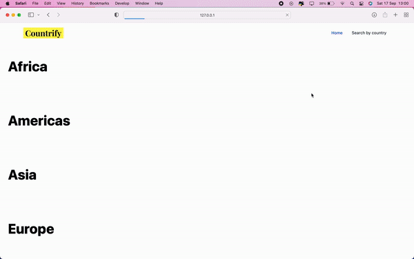
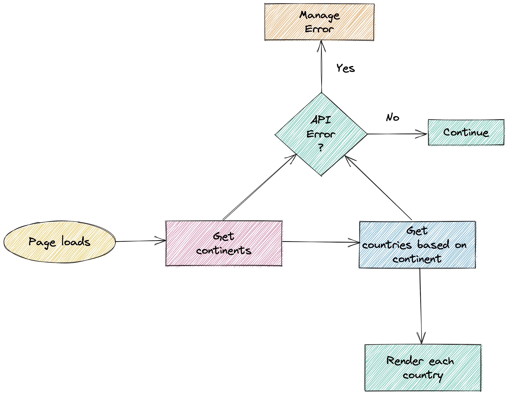
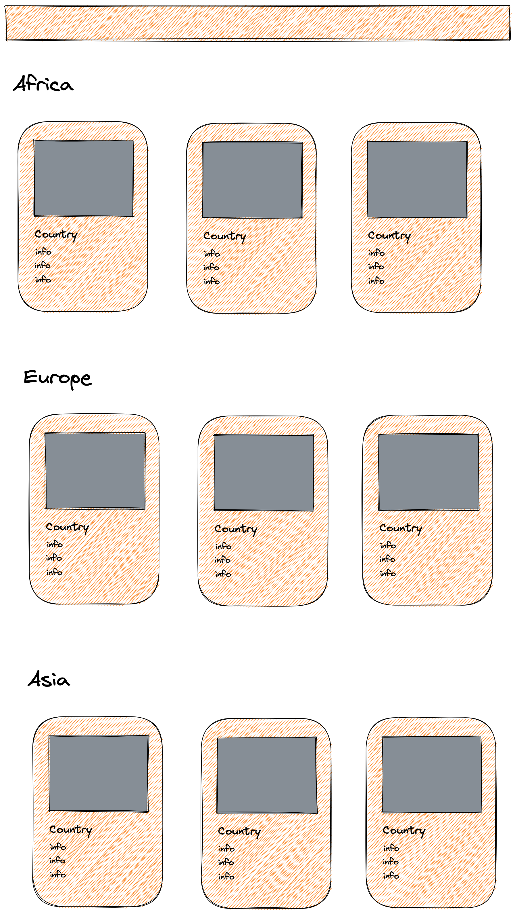

# Countrify

Countrify is a beautiful web application that consumes API's to display a list of countries within each continent in the world.

## Demo

  

## 🚀 Tech

 Javascript

 Tailwind

## ✋🏻 Pre-requisites

- [Terminal](https://www.youtube.com/watch?v=5XgBd6rjuDQ)

## 🔥 Install & Execute

1. Clone the repo;
2. Open the cloned repo;
3. Run `NPM install`

## 📜 User Story

As a user, I want to view continents and their respective countries so that I can view at a glance all information related to them.

## 🪩 Feature

1. An API to extract information about continents
2. An API to extract countries and an overview about them

## 🗺 Flowchart

  

## Wireframe

  

## 🏛 Chosen paradigm

Functional programming

## ☄️ Future Improvements

1. Lazy loading
2. Search by country
3. Quiz game

Made with ❤️ by Joselson
